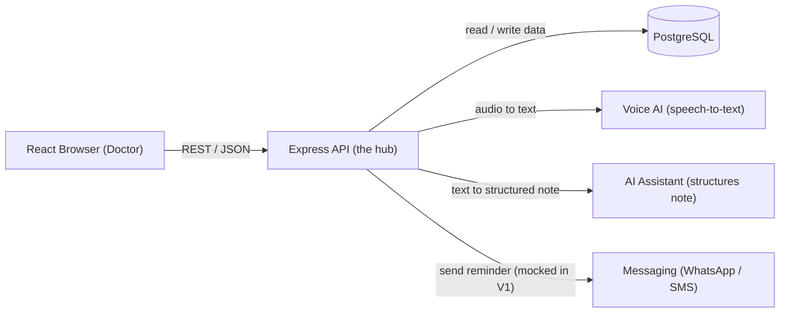

# Clinica

AI-native operating system for small clinics. A doctor speaks a
consultation, AI structures it into an editable note; patients access their own
records; clinics get visibility into treatments and revenue.

**V1 scope (3 features only):** patient profiles + visit history, AI visit
transcription (always doctor-editable), and basic scheduling with reminders.

## Architecture

The browser never talks to the database or AI directly — every request routes
through the Express API (the hub), which fans out to the right helper:



## Tech stack

- **Frontend:** React + Vite + TypeScript — `client/`
- **Backend:** Node + Express + TypeScript — `server/`
- **Database:** PostgreSQL (via Prisma)
- **AI:** voice-to-text + an LLM assistant for note structuring
- **Shared:** common TypeScript domain types — `packages/types/`
- **Tooling:** pnpm workspaces (monorepo)

## Monorepo structure

```text
clinica/
  package.json          # pnpm workspace root
  pnpm-workspace.yaml
  .gitignore
  README.md             # you are here
  PROGRESS.md           # build journal
  client/               # React frontend
  server/               # Express API
  packages/
    types/              # shared TS types
```
