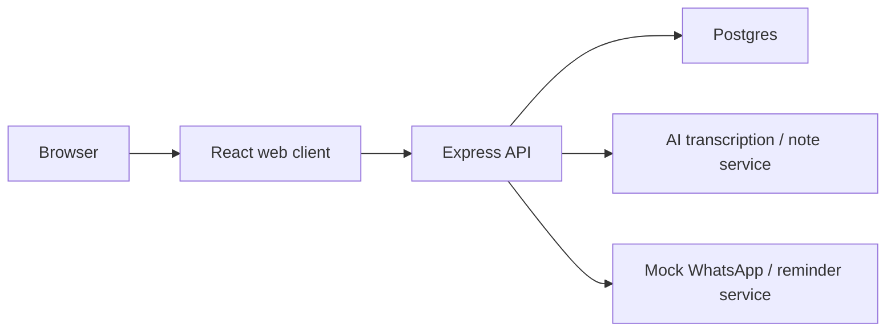

# Clinica V1 — Architecture

Clinica is an AI-assisted clinic operating system for doctors: patient CRUD, visits, appointments, and AI-drafted visit notes that a human edits before save.

This document is the Chapter 1 map. No application code yet — only system ownership.

## High-level system

## Layers

### 1. React web client

- Runs in the browser (Vite + React in development).
- Owns UI: doctor dashboard, patient list/forms, visit note panel, schedule, billing shell, patient portal shell.
- Talks to the API over HTTP (JSON). Does not talk to Postgres or AI providers directly.
- V1 auth: JWT stored client-side; protected routes by role (doctor / receptionist / patient).

### 2. Express API

- Node.js REST server under `server/` (built in later chapters).
- Owns routing, validation, auth middleware, business rules, and orchestration.
- Is the only app code that calls Postgres, AI, or the mock reminder service.
- Exposes resources such as `/api/patients`, `/api/visits`, `/api/appointments`, auth, and note/job endpoints.

### 3. Postgres database

- Persistent source of truth for V1.
- Planned entities: `User`, `Patient`, `Visit`, `Appointment`, `AuditLog` (and job/status records as needed for async transcription).
- Accessed via Prisma once Chapter 9 lands.

### 4. AI transcription / note service

- External provider (e.g. Whisper for audio → text, Claude/OpenAI for draft notes).
- Called **only from the Express API**, never from the browser with product secrets.
- Output is a draft: chief complaint / assessment / plan style notes that the doctor edits before save.

### 5. Mock WhatsApp / reminder service

- V1 architecture placeholder: API-shaped stub for appointment reminders.
- Not a real WhatsApp Business integration in V1 (deferred to V2).
- Exists so the architecture shows where notifications will hang off the backend.

## Feature → layer ownership

| Feature | Browser | Express API | Postgres | AI | Mock reminders |
|---------|---------|-------------|----------|-----|----------------|
| Static dashboard shell | Owns UI | — | — | — | — |
| List / create patients | UI + forms | REST + validation | Persist patients | — | — |
| Visits & appointments | UI | REST | Persist rows | — | — |
| Login / roles | Login UI, store JWT | Hash/verify, issue JWT | Users | — | — |
| AI draft visit note | Upload UI, edit panel | Orchestrate call | Store draft/job | Generate | — |
| Appointment reminder (V1) | Optional status UI | Call mock service | Optional log | — | Mock send |

## Request paths (summary)

1. **Static page** — Browser ↔ React host only.
2. **Patient list** — React → Express → Postgres → JSON → React.
3. **AI note from audio** — React → Express → (Postgres job) → AI provider → Express → React (editable draft).

## Explicitly out of V1

Real WhatsApp, Razorpay, lab-report RAG, live transcription, multi-tenancy, cloud migration to AWS/Azure. Those wait until a deployed V1 works.

## Stack (planned)

| Layer | Choice |
|-------|--------|
| Frontend | React + Vite, React Router, React Query, Zustand/Context |
| Backend | Node.js + Express |
| DB / ORM | PostgreSQL + Prisma |
| Auth | bcrypt + JWT |
| Validation | Zod at API boundaries |
| Ops | Docker Compose, GitHub Actions, deploy to Railway/Render/Fly/VPS |
