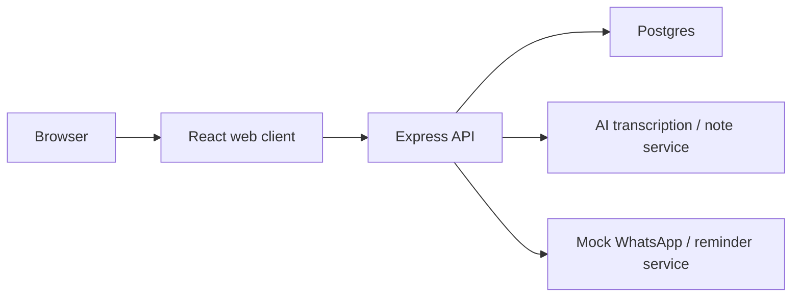

# Clinica — Architecture

Clinica is an AI-assisted clinic operating system for doctors: patient management, visits, appointments, and AI-drafted visit notes that a clinician reviews and edits before save.

## System overview

## Layers

### React web client

- Runs in the browser (Vite + React in development).
- Owns UI: doctor dashboard, patient list/forms, visit note panel, schedule, billing, and patient portal.
- Talks to the API over HTTP (JSON). Does not talk to Postgres or AI providers directly.
- Auth: JWT on the client; routes gated by role (doctor / receptionist / patient).

### Express API

- Node.js REST server under `server/`.
- Owns routing, validation, auth middleware, business rules, and orchestration.
- Sole application layer that calls Postgres, AI providers, or the reminder service.
- Exposes resources such as `/api/patients`, `/api/visits`, `/api/appointments`, auth, and note/job endpoints.

### Postgres

- Persistent source of truth for V1.
- Core entities: `User`, `Patient`, `Visit`, `Appointment`, `AuditLog` (plus job/status records for async transcription).
- Accessed via Prisma.

### AI transcription / note service

- External provider (e.g. Whisper for audio → text, Claude/OpenAI for draft notes).
- Called only from the Express API — never from the browser with product secrets.
- Returns drafts (chief complaint / assessment / plan). Clinicians edit before save.

### Mock WhatsApp / reminder service

- API-shaped stub for appointment reminders in V1.
- Real WhatsApp Business integration is deferred to V2.
- Reminder traffic hangs off the backend, not the client.

## Request paths

1. **Static page** — Browser ↔ React host only.
2. **Patient list** — React → Express → Postgres → JSON → React.
3. **AI note from audio** — React → Express → (Postgres job) → AI provider → Express → React (editable draft).

## Stack

| Layer | Choice |
|-------|--------|
| Frontend | React + Vite, React Router, React Query, Zustand/Context |
| Backend | Node.js + Express |
| DB / ORM | PostgreSQL + Prisma |
| Auth | bcrypt + JWT |
| Validation | Zod at API boundaries |
| Ops | Docker Compose, GitHub Actions; deploy to Railway / Render / Fly / VPS |
